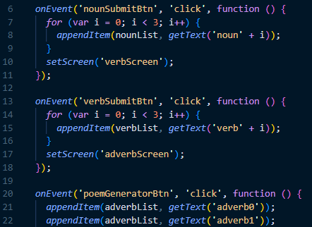
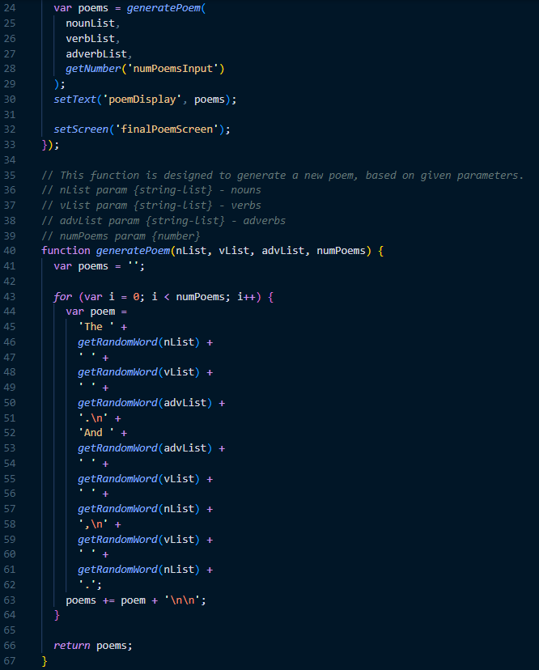
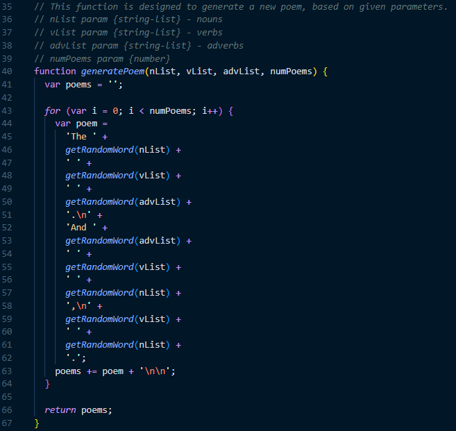
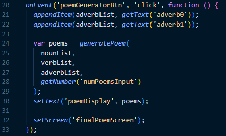

# AP CSP Create Task Exemplar: Poem Generator

Programming is a collaborative and creative process that brings ideas to life through the development of software. In the Create performance task, you will design and implement a program that might solve a problem, enable innovation, explore personal interests, or express creativity. Your submission must include elements listed in the following "Submission Requirements" sections.

### Program Code Submission Requirements

In your program you must include student-developed program code that contains the following:

- Instructions for **input** from one of the following:
  - the user (including user actions that trigger events)
  - a device
  - an online data stream
  - a file
- Use of at least one **list** (or other collection type) to represent a collection of data that is stored and used to manage program complexity and help fulfill the program's purpose.
  - Note, _the data abstraction must make the program easier to develop_ (alternatives would be more complex) or easier to maintain (future changes to the size of the list would otherwise require significant modifications to the program code).
- At least one **procedure (a.k.a. "function")** that contributes to the program's intended purpose, where you have defined:
  - the procedure's name
  - the return type (if necessary)
  - one or more parameters
- An **algorithm** that includes sequencing, selection, and iteration that is in the body of the selected procedure
- Calls to your student-developed procedure
- Instructions for **output** (tactile, audible, visual, or textual) **based on input** and program functionality

### Video Submission Requirements

Submit one video file that demonstrates your program running. It must include:

- **input** to your program
- at least one aspect of the functionality of your program
- **output** produced by your program

It may **NOT** contain:

- any distinguishing information about yourself
- voice narration (though text captions are encouraged)

It must be:

- either .mp4, .wmv, .avi, or .mov format
- no more than 1min in length
- no more than 30mb file size

### Exemplar Written Responses

Submit your responses to prompts 3(a) – 3(d), which are described below. Your responses to all prompts combined must not exceed 750 words (program code is not included in the word count).

**3(a).** In ~150 total words provide a written response that does all three of the following:

1. Describes the overall **purpose** of the program

_The purpose of this program is to provide users with a fun and creative way to generate poetry._

2. Describes what **functionality** of the program is demonstrated in the video

_The video demonstrates the functionality of this program by generating three poems as specified by the user's inputs of words like ent, mermaid, nebula, etc., and their selection of [3] in response to the "How many poems would you like?" prompt._

3. Describes the **input** and **output** of the program demonstrated in the video

_In the video, the app prompts the user to **input** three nouns, three gentle verbs (on the next screen), two adjectives, and a number (1-3) to indicate the number of poems they want to generate. After they input all this information, they press the "Generate Poem(s)" button, which directs them to the final screen of the application where their beautiful poems are displayed. These poems are the **output** of this program._

**3(b).** Capture and paste two program code segments you developed during the administration of this task that contain a list (or other collection type) being used to manage complexity in your program.

1. The first program code segment must show how data have been stored in the list.

2. The second program code segment must show the data in the same list being used, such as creating new data from the existing data or accessing multiple elements in the list, as part of fulfilling the program’s purpose

Then provide a ~200 word written response that does all three of the following:

3. Identifies the **name of the list** being used in this response

_Three lists -- ‘nounList’, ‘verbList’, and ‘adverbList’ -- are involved in the ‘generatePoem’ procedure call on line [24]._

4. Describes what the data contained in the list represents in your program

_The data contained in these lists represent user-inputted nouns, verbs, and adverbs._

5. Explains how the selected list manages complexity in your program code by explaining why your program code could not be written or how it would be written differently if you did not use the list

_The selected lists manage complexity in the program code by providing a structured way to store and retrieve user inputs. Without them, the program would have to rely on individual variables to store each user input, leading to a significant increase in code complexity and difficulty managing these additional variables. It would also be effectively impossible to loop through all the user inputs and generate a poem without the lists._

_For example, instead of using a list to store the nouns, verbs, and adverbs, the program would have to declare individual variables for each noun, verb, and adverb input. You would subsequently need to alter the code to accommodate the changing number of user inputs, making it difficult to scale the program up to handle more or fewer inputs._

_In short, using lists makes the program code more organized, easier to manage, and scalable to accommodate future changes._

**3(c).** Capture and paste two program code segments you developed during the administration of this task that contain a student-developed procedure (a.k.a. “function”) that implements an algorithm used in your program and a call to that procedure.

1. The first program code segment must be a student-developed procedure that:

- Defines the **procedure's name** and return type (if necessary)
- contains and uses one or more **parameters** that have an effect on the functionality of the procedure
- implements an **algorithm** that includes sequencing, selection, and iteration

2. The second program code segment must show where your student-developed procedure is being called in your program

Then, provide a ~200 word written response that does both of the following:

3. Describes in general what the identified procedure does and how it contributes to the overall functionality of the program
4. Explains in detailed steps how the algorithm implemented in the identified procedure works. Your explanation must be detailed enough for someone else to recreate it.

_The 'generatePoem' function in this program is a crucial procedure that generates the poem itself based on the user's input. It accepts three lists of strings as parameters (nList, vList, and advList) and an integer for the number of poems to generate. The algorithm implemented in this procedure involves the use of sequencing, selection, and iteration to generate the poems._

_Here's how the algorithm works in detailed steps:_

1. _Declare a variable called 'poems' and initialize it to an empty string._
2. _For each poem to be generated, repeat the following steps: (a) Declare a variable called 'poem' and initialize it to a string value. (b) Construct the 'poem' by concatenating three randomized phrases: "The [random noun] [random verb] [random adverb].", "And [random adverb] [random verb] [random noun],", and "[random verb] [random noun]." using the 'getRandomWord' helper function. (c) Add the 'poem' string to the 'poems' variable, followed by two new lines._
3. _Return the 'poems' variable, containing all the generated poems._

_In summary, the 'generatePoem' function generates the poems by using randomized words from the three user-input lists and concatenating them into a specific structure to form a complete poem. The function is essential to the program as it generates the output that the user expects, which is a fun and creative poem based on their input._

**3(d).** Provide a ~200 word written response that does all three of the following:

1. Describes two calls to the procedure identified in written response 3(c). Each call must pass a different argument(s) that causes a different segment of code in the algorithm to execute.

- first call:

**_generatePoem([“timber”, “lagoon”, “supernova”], [“disarms”, “floats”, “rests”], [“passionately”, “impetuously”], 1);_**

- second call:

**_generatePoem([“timber”, “lagoon”, “supernova”], [“disarms”, “floats”, “rests”], [“passionately”, “impetuously”], 3);_**

2. Describe what condition(s) is being tested by each call to the procedure.

- condition(s) tested by the first call:

_The first call passes a list of nouns, verbs, and adjectives to the generatePoem function. It also sets the 'numPoems' parameter to [1]. This set of conditions tests the function's ability to produce a single poem with words pulled from each list._

- condition(s) tested by the second call:

_The second call also passes a list of nouns, verbs, and adjectives to the generatePoem function. But it sets the 'numPoems' parameter to [3] instead of [1], which matters because it will test whether or not the function can responsively produce the correct number of poems._

3. Identifies the result of each call.

- result of the first call:

_As a result of the first call, the program will generate a single poem that includes at least one of the nouns (timber, lagoon, or supernova), at least one of the verbs (disarms, floats, rests), and at least one of the adjectives (passionately, impetuously)._

- result of the second call:

_As a result of the second call, the program will generate three poems that include at least one of the nouns (timber, lagoon, or supernova), at least one of the verbs (disarms, floats, rests), and at least one of the adjectives (passionately, impetuously)._
